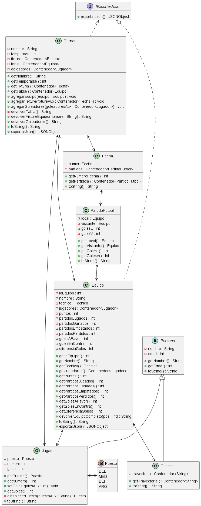

# appTorneo

**appTorneo** es un proyecto de software que gestiona una liga de fútbol.

**appTorneo** is a software project that manages a football league.

### Diagrama de clases/Class diagram

## Autores/Authors

- Agustin Rojas [ [GitHub](https://github.com/agustinrojass) - [LinkedIn](https://www.linkedin.com/in/agustinrojas259/) ]
- Joans Febbro [ [GitHub](https://github.com/jonasFebbro) ]
- Luca Coppari [ [GitHub](https://github.com/lucacoppari12) ]

## Links

- [Github](https://github.com/agustinrojass/appTorneo)
- [API-Football](https://www.api-football.com/)

## Licencia/License

[GNU](https://www.gnu.org/licenses/gpl-3.0.html)

